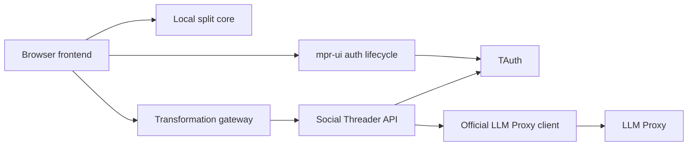

# Social Threader Architecture

Social Threader has a guest browser path and an authenticated thread transformation path. Both paths use the same editor and chunk lifecycle.

## System Boundaries

The browser owns editor interaction, preview state, and local chunk output. It does not own prompts, model routing, or credentials.

The API owns authorization, validation, prompt policy, limits, and LLM Proxy access. It does not persist source or transformed text.

TAuth owns browser authentication and profile-specific session cookies. `mpr-ui` owns the browser authentication lifecycle.

LLM Proxy owns model-provider routing and provider credentials. Social Threader uses one dedicated tenant secret.

## Browser Frontend

`js/app.js` is the composition root. It creates the guest controller and the transformation coordinator.

`js/ui/inputPanel.js` owns the editable document snapshot. Its public `replacePlainText` method emits the normal input event.

`js/core/chunking.js` and `js/core/richText.js` own local split behavior. Authentication does not gate these modules.

`js/ui/transformationToolbar.js` renders the closed operation catalog. It explains authentication, empty draft, image, and active request states.

`js/ui/transformationPreview.js` renders model output with `textContent`. It owns Apply, Discard, Try again, stale, error, and Undo controls.

`js/core/transformationCoordinator.js` owns request state and editor revisions. It reacts only to the documented `mpr-ui` authentication lifecycle.

`js/core/authLifecycle.js` uses the documented public `mpr-ui` snapshot when that optional helper is present. It reconciles an already-settled session without inspecting component state, cookies, or tokens.

`js/core/gateway.js` is the only browser transport adapter. It includes credentials, validates JSON, and propagates cancellation.

All transformation labels and browser-owned messages live in `js/constants.js`.

## Image Boundary

`InputPanel` converts each image into a document record. The record contains a placeholder token, data URL, and alt text.

The thread transformation path accepts plain text only. Any image disables all operation controls.

The coordinator does not remove or ignore an image. Tests compare image records and data URL bytes after attempted interactions.

## API Composition

`cmd/social-threader-api` loads `configs/config.yml`. It creates one application graph and one official LLM Proxy client.

`internal/application` connects configuration, TAuth authorization, transformation service, LLM Proxy adapter, and HTTP API.

`internal/authorization` uses the official TAuth `sessionvalidator` package. It validates the exact tenant, issuer, signing key, and cookie name.

`internal/transformation` owns the closed operations and versioned prompt catalog. It also validates plain-text completion size.

`internal/llmproxyadapter` uses the official `llmproxyclient` messages API. It maps model, reasoning effort, output tokens, and request timeout.

`internal/httpapi` owns `POST /v1/thread-transformations` and `GET /healthz`. It validates transport input before domain construction.

## Request Sequence

1. `mpr-ui` reports the authenticated lifecycle.
2. The user selects one operation.
3. The coordinator records the editor revision and a new request ID.
4. The transformation gateway sends one credentialed request.
5. The API validates CORS, TAuth, JSON, text size, and operation identity.
6. Admission state checks concurrency, user rate, capacity, and idempotency.
7. The service builds the versioned server-owned prompt.
8. The official client sends the request to LLM Proxy.
9. The API returns a plain-text representation.
10. The browser shows a preview without an editor change.

The browser never retries automatically. `Try again` creates one explicit request with a new request ID.

## Admission And Idempotency

The API keeps bounded process memory for rate windows, capacity, and idempotency. It has no durable application database.

An idempotency record uses an irreversible subject key and client request ID. It also stores a source fingerprint and short-lived successful result. The API removes failed records.

An exact retry returns the first result without a second completion. Conflicting request ID reuse returns `409`.

The API propagates request cancellation to the official client. It maps upstream failures into stable content-free application errors.

## Content And Log Policy

The first release does not persist source or transformed text. It does not log prompts, text, credentials, or provider bodies.

Logs contain request ID, irreversible subject key, operation, template version, input size, output size, duration, and outcome.

Browser analytics must not receive source text, transformed text, prompts, or credentials.

## Profiles

`configs/config.yml` defines the complete local and hosted application profiles. Startup selects one profile with `SOCIAL_THREADER_PROFILE`.

`config-app.json` maps a browser origin to its API origin. The browser fails closed for an unknown origin.

`config-ui.yaml` defines the current `mpr-ui` TAuth contract. Social Threader does not call TAuth browser endpoints directly.

## Local And Production Topologies

`docker-compose.yml` owns local orchestration. It connects Caddy, the API, TAuth, and the fake LLM Proxy.

`.mprlab/deploy/resources.yml` owns production orchestration. It declares schema-v4 resources for the sibling gateway.

The manifest owns the SemVer release scheme. The removed `.mprlab/release.yml` file does not define a second release contract.

The gateway owns the Pages `CNAME`, `.nojekyll`, and release marker files. The `pages` image contains only application files.

The Android resource uses the local build and publisher scripts. The publisher verifies credentials and exact provider state before submission.

The local Compose file is not a production lifecycle input. The production manifest is not a local Compose input.

The Dockerfile has separate `api`, `fake-llm-proxy`, `local-web`, and `pages` targets. The Pages target contains only public files.

## Mobile Boundary

The Expo client reuses the guest split engine. F001 does not add authentication or thread transformations to that client.

A later issue must define native TAuth profiles, session restoration, secure cookie or token transport, and mobile acceptance evidence.

## Validation Boundaries

Happy DOM tests validate browser public modules and DOM behavior. Puppeteer validates credentialed fetch and real browser rendering.

Go tests validate configuration, official client requests, cancellation, authorization, API behavior, prompts, and deployment contracts.

The local smoke test validates the real Caddy, TAuth, API, and fake-proxy topology. It makes no paid provider call.

Hosted acceptance remains a separate operator activity. Local success does not prove hosted DNS, TLS, sessions, CORS, or provider routing.
